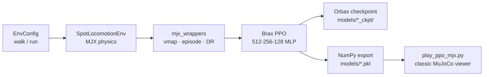

<div align="center">

# 🐕 mujoco_spot_RL

**GPU-accelerated** quadruped locomotion for Spot in **MuJoCo MJX** — Brax PPO training (walk → run), domain randomization, and JIT-free playback in the classic MuJoCo viewer.


</div>

---

## 📋 Table of Contents

- [Overview](#-overview)
- [Demo](#-demo)
- [Training Stages](#-training-stages)
- [Package Structure](#-package-structure)
- [Dependencies](#-dependencies)
- [Installation & Setup](#-installation--setup)
- [Running](#-running)
- [How It Works](#-how-it-works)
- [CLI Reference](#-cli-reference)
- [Outputs & Checkpoints](#-outputs--checkpoints)
- [Notes](#-notes)

---

## 🎯 Overview

This repo trains a **velocity-tracking locomotion policy** for a Spot-like quadruped in **MuJoCo MJX** on the GPU. Training uses **Brax PPO** with thousands of parallel environments; playback reuses the exported NumPy policy in the **classic MuJoCo viewer** (no JAX physics, no JIT warmup).

The stack is split into two stages — **walk** then **run** — with curriculum-style command ranges and gait timing. Domain randomization (friction, mass, damping) and observation noise are enabled by default.

| Component | Path | Role |
|---|---|---|
| `SpotLocomotionEnv` | `envs/spot_locomotion_mjx.py` | Brax MJX env: velocity commands, gait clock, reward |
| `load_spot_mjx` | `envs/mjx_spot_model.py` | Shared model loader + Euler / pyramidal-cone patches |
| `mjx_wrappers` | `envs/mjx_wrappers.py` | `vmap`, episode tracking, autoreset, domain randomization |
| `train_ppo_mjx` | `scripts/train_ppo_mjx.py` | Brax PPO training (walk / run, resume, smoke test) |
| `play_ppo_mjx` | `scripts/play_ppo_mjx.py` | NumPy MLP playback in `mujoco.viewer` |
| `bench_mjx` | `scripts/bench_mjx.py` | Throughput + stability sweep for `timestep` / `frame_skip` |
| `view_spot` | `scripts/view_spot.py` | Passive viewer at the `home` keyframe (no policy) |

URDF, MJCF (`spot.xml`, `scene.xml`), and the Spot mesh assets are **self-contained** in this repo.

---

## 🎥 Demo

Trained walk/run policies in the MuJoCo viewer — velocity commands from slow trot to ~5 m/s run:

<div align="center">

[](https://youtu.be/nQ8diQvs56I)

**▶️ [Watch the Spot Locomotion Demo](https://youtu.be/nQ8diQvs56I)**

</div>

Replay locally:

```bash
python scripts/play_ppo_mjx.py --stage walk --vx 0.6
python scripts/play_ppo_mjx.py --stage run --vx 5.0
```

---

## 🏃 Training Stages

### Walk (stage 1)

Forward speed command `vx ∈ [0, 1.0]` m/s, moderate lateral / yaw limits, slower gait periods. Default budget: **20M** env steps.

```bash
python scripts/train_ppo_mjx.py --stage walk --timesteps 20000000
```

### Run (stage 2)

Resume from a walk checkpoint; expand commands to `vx ∈ [-0.3, 5.0]` m/s (~5× walk), faster gait, larger leg travel. Default budget: **60M** additional env steps.

```bash
python scripts/train_ppo_mjx.py --stage run --timesteps 60000000 \
  --resume models/ppo_spot_mjx_walk_ckpt
```

Cap top speed if sim gets rough past ~7 m/s (`dt × frame_skip = 0.02`):

```bash
python scripts/train_ppo_mjx.py --stage run --vx-max 7 --timesteps 60000000 \
  --resume models/ppo_spot_mjx_walk_ckpt
```

### Quick smoke test

Validates plumbing and PPO metrics on a short run (200k steps, ≤512 envs):

```bash
python scripts/train_ppo_mjx.py --smoke --stage walk
```

---

## 📁 Package Structure

```
mujoco_spot_RL/
├── envs/
│   ├── spot_locomotion_mjx.py   # Brax Env: obs, reward, gait, commands
│   ├── mjx_spot_model.py        # MjModel / MJX loader + GPU patches
│   ├── mjx_wrappers.py          # vmap, episode, autoreset, DR
│   └── __init__.py
├── scripts/
│   ├── train_ppo_mjx.py         # Brax PPO (walk / run)
│   ├── play_ppo_mjx.py          # Classic viewer playback
│   ├── bench_mjx.py             # MJX throughput benchmark
│   ├── view_spot.py             # Home-pose viewer
│   └── urdf_to_mjcf.py          # URDF → MJCF helper
├── urdf/
│   └── spot_zero_mujoco.urdf
├── spot.xml                     # Robot MJCF
├── scene.xml                    # Floor + lighting + home keyframe
├── models/                      # Policies + Brax checkpoints (gitignored)
├── logs/mjx/                    # Training logs (gitignored)
├── requirements.txt
└── README.md
```

---

## 📦 Dependencies

**Core:** `mujoco` ≥ 3.2, `numpy` ≥ 1.26

**MJX + Brax PPO (GPU):** `jax[cuda12]` ≥ 0.11, `mujoco-mjx` ≥ 3.2, `brax` == 0.14.2, `flax` ≥ 0.12, `optax` ≥ 0.2, `orbax-checkpoint` ≥ 0.12

A CUDA-capable GPU is strongly recommended for training (tested around **~9k env-steps/s** on GTX 1650 Ti with 4096 envs). Playback runs on CPU with classic MuJoCo only.

---

## 🔧 Installation & Setup

### Prerequisites

- Python 3.10+
- NVIDIA GPU + CUDA 12 (for JAX GPU backend)
- A virtualenv or conda env (example below uses `mjenv`)

### Install

```bash
cd /path/to/mujoco_spot_RL
python -m venv /path/to/mjenv        # or use your existing env
source /path/to/mjenv/bin/activate
pip install -r requirements.txt

# Important on 4 GB GPUs — prevents JAX from grabbing all VRAM upfront
export XLA_PYTHON_CLIENT_PREALLOCATE=false
```

---

## 🚀 Running

### Benchmark sim config

Lock in `timestep` and `frame_skip` before long training runs. The benchmark only keeps combos where `timestep × frame_skip ≈ 0.02` s control period.

```bash
python scripts/bench_mjx.py
```

Default locked config on GTX 1650 Ti: `timestep=0.004`, `frame_skip=5`, `num_envs=4096` (~9k env-steps/s).

### Train PPO

See [Training Stages](#-training-stages). Continue an interrupted run:

```bash
python scripts/train_ppo_mjx.py --stage run --timesteps 60000000 \
  --resume models/ppo_spot_mjx_run_ckpt
```

### Playback (no JAX physics)

Uses `mujoco.viewer` + exported NumPy MLP — instant startup, no JIT stall.

```bash
python scripts/play_ppo_mjx.py --stage walk --vx 0.6
python scripts/play_ppo_mjx.py --stage run --vx 3.0
python scripts/play_ppo_mjx.py --stage run --vx 5.0
```

Optional lateral / yaw commands and heading hold:

```bash
python scripts/play_ppo_mjx.py --stage run --vx 4.0 --vy 0.2 --wz 0.3
python scripts/play_ppo_mjx.py --stage walk --vx 0.8 --no-heading-hold
```

### Model preview (no policy)

```bash
python scripts/view_spot.py
```

---

## 🔄 How It Works

### Training pipeline



**Summary:**

1. `load_spot_mjx` loads `scene.xml`, applies **Euler + pyramidal cone + foot `condim=3`** patches shared by train and play (no sim-to-sim gap).
2. Each step samples a velocity command `(vx, vy, ωz)` with periodic resampling; a **gait phase clock** (trot offsets) is fed into the 60-dim observation, stacked **3 frames** → 180-dim policy input.
3. Actions are 12 leg joint deltas (filtered, scaled per joint type) added to a default standing pose; PPO optimizes tracking, upright, height, air-time, slip, and smoothness terms.
4. Domain randomization perturbs friction, base mass, and joint damping per env; disable with `--no-domain-rand`.
5. After training, weights are exported to a `.pkl` for NumPy inference; Brax Orbax dirs support `--resume`.

### Observation & action

| Signal | Dim | Description |
|---|---|---|
| Command | 3 | `vx`, `vy`, `ωz` (body frame) |
| Base kinematics | 9 | body-frame lin vel, ang vel, projected gravity |
| Joints | 24 | leg position (rel. default) + velocity |
| Previous action | 12 | filtered joint deltas |
| Gait clock | 8 | sin/cos phase per foot |
| Foot contact | 4 | binary contact flags |
| **Stack** | ×3 | 60 → **180** total |

| Action | Dim | Description |
|---|---|---|
| Leg joints | 12 | `tanh` deltas → hip roll/yaw + knee per leg |

Leg joints live at `qpos[9:21]` (laser joints occupy `qpos[7:9]`); the MJX env indexes them by name.

---

## ⚙️ CLI Reference

### `train_ppo_mjx.py` (selected)

| Flag | Default | Description |
|---|---|---|
| `--stage` | `walk` | `walk` or `run` command / gait profile |
| `--timesteps` | 20M / 60M | Env steps this run (additional on resume) |
| `--num-envs` | `4096` | Parallel MJX environments |
| `--timestep` | `0.004` | MuJoCo integrator step (s) |
| `--frame-skip` | `5` | Physics substeps per control step |
| `--resume` | — | Brax `*_ckpt` dir or numbered step subdir |
| `--vx-max` | stage default | Override forward speed cap |
| `--no-domain-rand` | off | Disable friction / mass / damping DR |
| `--no-obs-noise` | off | Zero observation noise |
| `--smoke` | off | Short sanity run |

### `play_ppo_mjx.py` (selected)

| Flag | Default | Description |
|---|---|---|
| `--model` | auto by stage | Path to `.pkl` policy |
| `--stage` | `walk` | Pick default model + gait config |
| `--vx` / `--vy` / `--wz` | stage / `0` | Velocity command |
| `--heading-kp` | `1.25` | Heading hold gain when `wz ≈ 0` |
| `--no-heading-hold` | off | Pass `wz` through literally |

### `bench_mjx.py` (selected)

| Flag | Default | Description |
|---|---|---|
| `--n-envs` | `1024 2048 4096` | Batch sizes to try |
| `--timestep` | `0.002 0.004` | Integrator steps (s) |
| `--frame-skip` | `10 5` | Substeps per control step |

---

## 💾 Outputs & Checkpoints

| Artifact | Path | Use |
|---|---|---|
| NumPy policy | `models/ppo_spot_mjx_{stage}.pkl` | `play_ppo_mjx.py` (instant load) |
| Brax checkpoint | `models/ppo_spot_mjx_{stage}_ckpt/` | `--resume` training |
| Training logs | `logs/mjx/` | Brax metrics / eval traces |

---

## 📝 Notes

- MJX applies **Euler + pyramidal cone + foot `condim=3`** at load time (shared by train and play) so there is no sim-to-sim gap between GPU training and CPU playback.
- Domain randomization (friction / mass / damping) is on by default; disable with `--no-domain-rand`.
- On low-VRAM GPUs, keep `export XLA_PYTHON_CLIENT_PREALLOCATE=false` in your shell profile.
- Brax 0.14.x expects `jax.device_put_replicated`; `train_ppo_mjx.py` patches this for JAX 0.11+.

---

<div align="center">
<sub>MuJoCo MJX · Brax PPO · Spot Locomotion · Walk → Run</sub>
</div>
